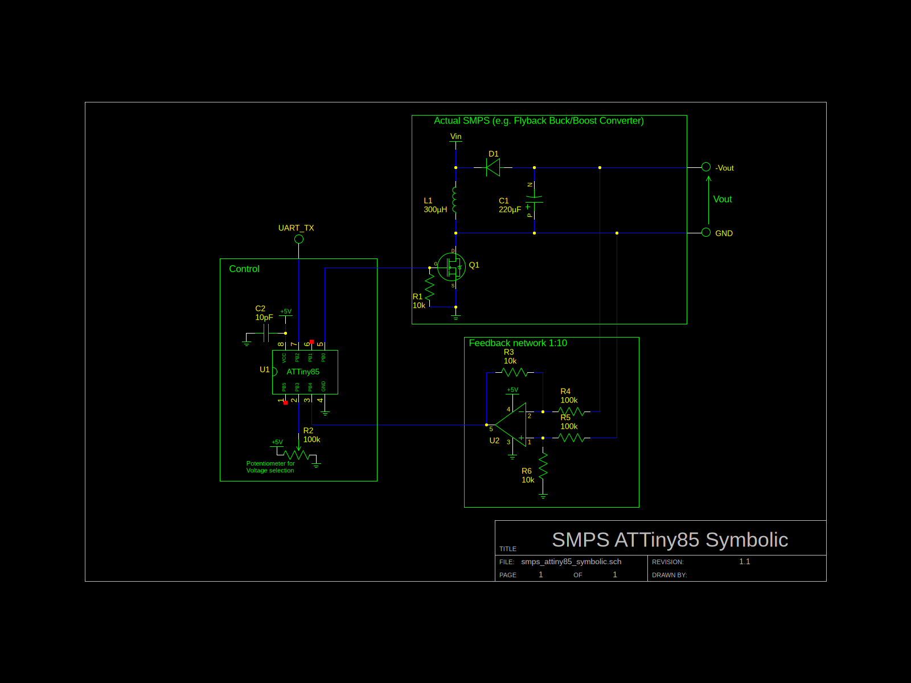

# SMPS Driver for ATTinys

A [switched-mode power supply](https://en.wikipedia.org/wiki/Switched-mode_power_supply) driver for ATTinyx5 MCUs

## Features

- Adjustable output voltage range
- Feedback
- UART info
- 31kHz PWM (for 8MHz MCUs)

## Build and Flash

Get the sources
```sh
git clone https://github.com/VipeOut23/smps_driver
cd smps_driver
git submodule update --init software_uart
```

Compile rom.hex with
```sh
make
```

Upload rom.hex with
```sh
make flash PORT=/dev/ttyACM0 PROGRAMMER=stk500v1 BAUD=19200
```

_These values may need to be adjusted to your specific programmer parameters (as fed in ```avrdude```)_


Additional parameters can be adjusted in the Makefile


## Example Setup


